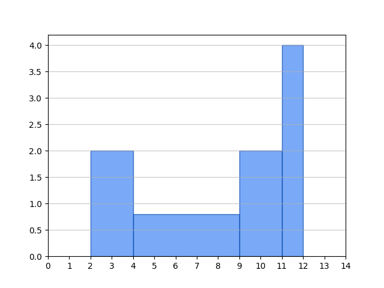

# Statistiques descriptives

## 1.1 Généralités

Une statistique est une application d'une population $\Omega$ vers un ensemble de valeurs $C$.

$$ \left\{\begin{array}{rl} X: & \Omega \rightarrow C\\ & \omega \rightarrow X(\omega) \end{array} \right. $$

- $\Omega$ : population finie d'individus $\omega$. On va mesurer/observer un caractère particulier sur ces individus.  
    >`population`  

- $C$ : ensemble des valeurs possibles du caractère, appelées aussi modalités.  
    >`modalites`  

- $X$ : Statistique (parfois appelée aussi caractère). Application qui à tout individu associe la valeur de son caractère.  
    >`serie`  

<!---->
- Une statistique peut être quantitative ou qualitative.
- Une statistique quantitative peut être discrète ou continue.
- Une statistique peut être multiple (à n paramètres).

## 1.2 Statistique simple (univariée)

### 1.2.1 Notations

On va se limiter à des statistiques quantitatives.

- $\Omega$ population finie de $N$ individus.
- $C\subset R$

#### **Première représentation :**

Une série statistique est un $N$-uplet $X= (v_1,\,v_2,\,...\,v_N)$  
Par exemple : $X= (2.1,\,5.23,\,0.61,\,2.1,\,7.2,\,0.61)$  
On parle alors de **série statistique brute**.

#### **Seconde représentation :**

L'ensemble des valeurs observables de $X$ est fini. On peut écrire :

$$ X(\Omega)=\{x_1,\,x_2,\,...\,x_p\}\;(1\leq p\leq N) $$

pour la suite on supposera $x_1<x_2<...<x_p$.

- Effectif $n_i=\#(X^−1 \{x_i\})$ : nombre de fois que la valeur $x_i$ a été observée dans la population ou nombre d'individus admettant $x_i$ comme valeur du caractère.  
    >`effectif(i)`  

- Effectif cumulé $N_i=\sum^i_{j=1}n_j=\#(X^{-1}\{]−\infin,x_i]\})$ : nombre d'individus présentant une valeur de caractère plus petite que $x_i$, ou égale. On a la relation $N_i=N_{i−1}+n_i$ en posant $N_0=0$ et peut remarquer que $N_p=N$  
    >`effectifC(i)`  

- Fréquence $f_i=n_i/N$.  
    >`frequence(i)`  

- Fréquence cumulée $F_i=N_i/N=\sum^i_{j=1} f_j=F_{i−1}+f_i$ en posant $F_0=0$. On remarque que $F_p=1$  
    >`frequenceC(i)`  

Une série statistique est une famille de la forme $(x_i,n_i)_{i\in [1,p]}$ ou $(x_i,f_i)_{i\in [1,p]}$  
On parle parfois de **série statistique dépouillée** ou de **série statistique regroupée et ordonnée**.

### 1.2.2 Paramètres de position

#### **Le mode**

C'est la valeur du caractère d'effectif maximal  
>`mode`  

$$ mode=x_i\text{ tq } n_i=\max_{1\leq j\leq p}(n_j) $$

Attention : il n'est pas forcément unique.

#### **La médiane**

C'est la valeur du caractère qui sépare la population en deux parties égales.  
Attention : parfois dificile à définir.  
>`mediane`  

$$\eta \text{ tq }\#\{\omega_i\,|\,X(\omega_i)<\eta \}=\#\{\omega_i\,|\,X(\omega_i)>\eta \}\\ \eta \text{ tq }\#\{\omega_i\,|\,X(\omega_i)\leq \eta \}=\#\{\omega_i\,|\,X(\omega_i)\geq \eta \}\\ \eta =x_i\text{ tq }N_{i−1}<N/2\leq N_i $$

#### **Les quantiles**

Dans le même esprit, on peut définir :

- les quartiles : 3 valeurs qui découpent la population en 4 parties égales. Le deuxième quartile étant alors égal à la médiane.
- les déciles : 9 valeurs qui découpent la population en 10 parties égales.
- les centiles : 99 valeurs qui découpent la population en 100 parties égales.
- ou tout autre découpage.

>`quantile(n)`  

#### **La moyenne arithmétique**

$$ m(X)=\bar{x}=\frac{1}{N}\sum^p_{i=1}(n_ix_i)=\sum^p_{i=1}(f_ix_i)=\frac{1}{N}\sum^N_{i=1}v_i $$
>`moyenne`  
Remarque : si on pose $n=(n_1,\,n_2,\,...\,n_p)$ et $X=(x_1,\,x_2,\,...\,x_p)$ alors :
$$ \sum^p_{i=1}(n_ix_i)=n\cdot X^t\text{ et }m(X)=\frac{1}{N}n\cdot X^t $$

### 1.2.3 Paramètres de dispersion

#### **L'étendue**

C'est la plage de valeur du caractère observée sur la population :
$$ w=\max_{1\leq i\leq p}(x_i)−\min_{1\leq i\leq p}(x_i)=\max_{1\leq i\leq N}(v_i)−\min_{1\leq i\leq N}(v_i) $$
>`etendue`  
Attention : sensible aux erreurs de mesure.

#### **Les intervalles interquantiles**

Dans le même ordre d'idée que l'étendue, on peut donner l'intervalle séparant le plus petit et
le plus grand décile (80% de la population) ou celui séparant le quartile inférieur $Q_I$ et le
quartile supérieur $Q_S$ (50% de la population) ou tout autre intervalle définie de manière
similaire.  

Intérêt : Élimine les mesures aberrantes.

#### **L'écart arithmétique moyen** *(peu utilisé)*

Calcule la moyenne des écarts à la moyenne.
$$ E=\frac{1}{N}\sum_{1\leq i\leq p}n_i|x_i−\bar{x}|=\sum_{1\leq i\leq p}f_i|x_i−\bar{x}|=\frac{1}{N}\sum_{1\leq i\leq p}|v_i−\bar{x}| $$
>`ecartMoyen`  

#### **L'écart quadratique moyen ou variance**

Calcule la moyenne des carrés des écarts à la moyenne.
$$ V(X)=\sigma^2_X=\frac{1}{N}\sum_{1\leq i\leq p}n_i(x_i−\bar{x})^2=\sum_{1\leq i\leq p}f_i(x_i−\bar{x})^2=\frac{1}{N}\sum_{1\leq i\leq p}(v_i−\bar{x})^2 $$
>`variance`  

Relation de Koenig-Huygens
$$ \sigma^2_X=\left(\frac{1}{N}\sum_{1\leq i\leq p}n_i\cdot x_i^2\right)-\bar{x}^2=\left(\sum_{1\leq i\leq p}f_i\cdot x_i^2\right)-\bar{x}^2=\left(\frac{1}{N}\sum_{1\leq i\leq p}v_i^2\right)-\bar{x}^2 $$

#### **L'écart type**

C'est la racine carré de la variance : même dimension que le caractère étudié.
$$ \sigma_X=\sqrt{V(X)}=\sqrt{\frac{1}{N}\sum_{1\leq i\leq  p}n_i(x_i−\bar{x})^2}=\sqrt{\left(\sum_{1\leq i\leq p}f_i\cdot x_i^2\right)-\bar{x}^2}=... $$
>`ecartType`  

### 1.2.4 Les moments

#### **Moment d'ordre k**

$$ m_k(X)=\frac{1}{N}\sum^p_{i=1}(n_i\cdot x_i^k)=\sum^p_{i=1}(f_i\cdot x_i^k)=\frac{1}{N}\sum^p_{i=1}v_i^k $$
>`moment(k)`  

#### **Moment centré d'ordre k**

$$ \mu_k(X)=\frac{1}{N}\sum^p_{i=1}(n_i\cdot (x_i-\bar{x})^k)=\sum^p_{i=1}(f_i\cdot (x_i-\bar{x})^k)=\frac{1}{N}\sum^p_{i=1}(v_i-\bar{x})^k $$
>`momentCentre(k)`  

Propriétés:

- $m_0(X)=\mu_0(X)=1$
- $m_1(X)=x\text{ et }\mu_1(X)=0$
- $\mu_2(X)=\sigma_X^2$
- $\sigma_X^2=m_2(X)−m_1(X)^2$ (Relation de Koenig-Huygens)
- Si une série statistique est symétrique par rapport à sa moyenne alors tous ses moments centrés d'ordre impair sont nuls.
- Par contre il ne sufft pas de vérifier que $\mu_3(X)=0$ pour conclure que la série est symétrique par rapport à sa moyenne.

### 1.2.5 Paramètres de formes

#### **Premier coeffcient de Fisher : coeffcient d'asymétrie**

$$ \delta=\frac{\mu_3}{\sigma^3}=\frac{\mu_3}{\mu_2^{3/2}} $$
>`asymetrie()`  

- série symétrique $\rightarrow\delta=0$
- grands écarts positifs % à la moyenne $\rightarrow\delta>0$ ("bosse décalée vers la gauche")
- grands écarts négatifs % à la moyenne $\rightarrow\delta<0$ ("bosse décalée vers la droite")
- le coeffcient d'asymétrie est considéré comme significatif lorsque $|\delta|>0.5$
- S'applique essentiellement à une série unimodale.

#### **Second coeffcient de Fisher : coeffcient d'aplatissement**

$$ \alpha=\frac{\mu_4}{\sigma^4}=\frac{\mu_4}{\mu^2_2} $$
>`aplatissement()`  

- Une grande valeur de $\alpha$ traduit un resserrement autour de la moyenne ("courbe en pic")
- Une petite valeur de $\alpha$ traduit un étalement de la série ("courbe plate")
- Si la distribution est normale alors $\alpha=3$
- S'applique essentiellement à une série unimodale.

### 1.2.6 Découpage en classes

Lorsque $X$ est un caractère continu ou que les fréquences $f_i$ sont faibles ($p$ proche de $N$) on est amené à découper le domaine de valeurs de $X$ en classes (sous-intervalles).  
>`classer([limites des classes])`  

$$ C_1=[a_0,a_1],\,C_2=]a_1,a_2],\,...\,C_{p'}=]a_{p'−1},a_{p'}] $$
avec $p'\leq p$ et $a_0\leq x_1<x_p\leq a_{p'}$

**Intérêt :** Représentation graphique (histogramme) et mise en évidence d'une classe modale (classe de hauteur maximale dans l'histogramme)  
$\rightarrow$ Les classes peuvent être éventuellement de largeurs différentes.

- On note alors $n_i$ l'effectif de la classe $C_i : n_i=\#\{X^{-1}]a_{i−1},a_i]\}$.
- On peut ensuite définir $N_i$, $f_i$ et $F_i$ comme vu précédemment pour une série statistique dépouillée.

La série est alors donnée sous la forme de la famille $((n_1,C_1),\,(n_2,C_2),\,...\,(n_{p'},C_{p'}))$
On parle alors d'une série statistique **en classes** ou **regroupée en classes** ou encore,
parfois, **classée**.

- À toute série classée on peut faire correspondre une série statistique dépouillée $(x'_i,n_i)_{i\in [1,p']}$ où $x'_i$ est le centre de la classe $C_i(x'_i=(a_{i−1}+a_i)/2)$.

### 1.2.7 Histogramme

Lorsque la statistique est découpée en classes, on ne la représente plus par un diagramme
en bâtons, mais par un histogramme. Chaque classe est représentée par un rectangle dont la
base est proportionnelle à la largeur de la classe et la **surface** proportionnelle à l'effectif (ou, ce qui revient au même, à la fréquence) de la classe. C'est bien la surface et non la hauteur du
rectangle qui est proportionnelle à l'effectif. Cette remarque prend toute son importance
lorsque les classes sont de largeurs différentes.

Exemple : on travaille sur une statistique découpées selon les quatre classes suivantes :
$[2,4],\,]4,9],\,]9,11],\,]11,12]$ et chaque classe est d'effectif $4$.  
L'axe des ordonnées peut être vu comme une densité.

### 1.2.8 La classe modale (paramètre de position)

C'est la classe correspondant au rectangle le plus haut dans l'histogramme (on parle bien
ici de hauteur et non de surface).Elle peut ne pas être unique. Il arrive qu'on définisse le mode
de la statistique comme le milieu de la classe modale (cette définition n'est pas entièrement
équivalente à celle donnée plus haut). Dans l'exemple précédent, la classe modale est la dernière
(classe $]11,12]$) et le mode est $11.5$.

## 1.3 Statistique double (bivariée)

### 1.3.1 Notations

On va se limiter à des statistiques quantitatives.

- $\Omega$ population finie de $N$ individus.
- Une statistique double $C$ est une application de $\Omega$ dans $\R^2$.

$$ \left\{\begin{array}{rl} C: & \Omega \rightarrow \R^2\\ & \omega \rightarrow C(\omega) \end{array} \right. $$

$C(\omega)$ est de la forme $(x,y)$. On peut définir deux statistiques simples à partir de $C$

#### **Première statistique marginale**

$$ \left\{\begin{array}{rl} X: & \Omega \rightarrow \R\\ & \omega \rightarrow \text{la première valeur du couple }C(\omega) \end{array} \right. $$

#### **Seconde statistique marginale**

$$ \left\{\begin{array}{rl} Y: & \Omega \rightarrow \R\\ & \omega \rightarrow \text{la seconde valeur du couple }C(\omega) \end{array} \right. $$

Par **abus de langage**, on écrit que $C=(X,Y)$.

Les ensembles des valeurs observables de $X$ et $Y$ sont finis. On peut écrire :
$$ X(\Omega)=\{x_1,\,x_2,\,...\,x_p\}\text{ par ordre croissant}\\Y(\Omega)=\{y_1,\,y_2,\,...\,y_q\}\text{ par ordre croissant} $$

avec $1\leq p\leq N,\;1\leq q\leq N$ et a priori $p\neq q$

#### **Effectifs et fréquences**

- Effectif $n_{ij}=\#(C^{-1}\{(x_i,y_j)\})$ : nombre d'individus admettant $(x_i,y_j)$ comme valeur du caractère $C$
- Effectif $n_{i\bull}=\#(X^{-1}\{x_i\})$ : nombre d'individus admettant $x_i$ comme première valeur du caractère $C$ ou nombre d'individus admettant $x_i$ comme valeur du caractère $X$  
    >Remarque : $n_{i\bull}=\sum_{1\leq j\leq q}n_{ij}$
- Effectif $n_{\bull j}=\#(Y^{-1}\{y_i\})$ : nombre d'individus admettant $y_i$ comme seconde valeur du caractère $C$ ou nombre d'individus admettant $y_i$ comme valeur du caractère $Y$  
    >Remarque : $n_{\bull j}=\sum_{1\leq i\leq q}n_{ij}$

On définit également les effectifs cumulés $N_{i\bull}$ et $N_{\bull j}$ ainsi que les fréquences $f_{ij}$, $f_{i\bull}$, $f_{\bull j}$, $F_{i\bull}$, et $F_{\bull j}$ en divisant les effectifs correspondants par $N$. Ainsi, par exemple :
$$ f_{ij}=\frac{n_{ij}}{N} $$

#### **Tableau de contingence**

| $X\backslash Y$ |     $y_1$     | $\ldots$ |     $y_j$     | $\ldots$ |     $y_q$     |   $total$    |
| :-------------: | :-----------: | :------: | :-----------: | :------: | :-----------: | :----------: |
|      $x_1$      |   $n_{11}$    | $\ldots$ |   $n_{1j}$    | $\ldots$ |   $n_{1q}$    | $n_{1\bull}$ |
|    $\vdots$     |   $\vdots$    | $\ddots$ |   $\vdots$    | $\ddots$ |   $\vdots$    |   $\vdots$   |
|      $x_i$      |   $n_{i1}$    | $\ldots$ |   $n_{ij}$    | $\ldots$ |   $n_{iq}$    | $n_{i\bull}$ |
|    $\vdots$     |   $\vdots$    | $\ddots$ |   $\vdots$    | $\ddots$ |   $\vdots$    |   $\vdots$   |
|      $x_p$      |   $n_{p1}$    | $\ldots$ |   $n_{pj}$    | $\ldots$ |   $n_{pq}$    | $n_{p\bull}$ |
|     $total$     | $n_{\bull 1}$ | $\ldots$ | $n_{\bull j}$ | $\ldots$ | $n_{\bull q}$ |     $N$      |

| $X\backslash Y$ |     $y_1$     | $\ldots$ |     $y_j$     | $\ldots$ |     $y_q$     |   $total$    |
| :-------------: | :-----------: | :------: | :-----------: | :------: | :-----------: | :----------: |
|      $x_1$      |   $f_{11}$    | $\ldots$ |   $f_{1j}$    | $\ldots$ |   $f_{1q}$    | $f_{1\bull}$ |
|    $\vdots$     |   $\vdots$    | $\ddots$ |   $\vdots$    | $\ddots$ |   $\vdots$    |   $\vdots$   |
|      $x_i$      |   $f_{i1}$    | $\ldots$ |   $f_{ij}$    | $\ldots$ |   $f_{iq}$    | $f_{i\bull}$ |
|    $\vdots$     |   $\vdots$    | $\ddots$ |   $\vdots$    | $\ddots$ |   $\vdots$    |   $\vdots$   |
|      $x_p$      |   $f_{p1}$    | $\ldots$ |   $f_{pj}$    | $\ldots$ |   $f_{pq}$    | $f_{p\bull}$ |
|     $total$     | $f_{\bull 1}$ | $\ldots$ | $f_{\bull j}$ | $\ldots$ | $f_{\bull q}$ |     $1$      |

### 1.3.2 Covariance et coeffcient de corrélation

#### **Covariance**

Elle donne une mesure du lien existant entre les deux caractères $X$ et $Y$.
$$ cov(X,Y)=\sigma_{XY}=\left(\frac{1}{N}\sum^p_{i=1}\sum^q_{j=1}n_{ij}x_iy_j\right)-\overline{xy}=\frac{1}{N}\sum^p_{i=1}\sum^q_{j=1}n_{ij}(x_i-\bar{x})(y_j-\bar{y}) $$
Si les deux caractères sont indépendants l'un de l'autre alors la covariance est nulle.  
Réciproque fausse.

#### **Coeffcient de corrélation**

C'est une normalisation de la covariance qui évite les effets d'échelle.
$$ \rho_{XY}=\frac{\sigma_{XY}}{\sigma_X\sigma_Y} $$

- $−1\leq \rho_{XY} \leq 1$
- Si $X$ et $Y$ sont indépendants alors $\rho_{XY}=0$.Réciproque fausse.
- S'il existe une relation affine entre $X$ et $Y$ alors $\rho_{XY}=\plusmn1$. Réciproque fausse.

### 1.3.3 Droite de régression linéaire

#### **Droite de régression de Y en X**

On cherche la droite d'équation $Y=aX+b$ approchant "au mieux" le nuage de points de la
statistique double $C$.
$$ \left\{\begin{array}{rl} a= & \frac{\sigma_{XY}}{\sigma^2_X} \\ b= & \bar{y}-\bar{x}\frac{\sigma_{XY}}{\sigma^2_X} \end{array} \right. $$

Cette droite passe par le point $(x,y)$

#### **Droite de régression de X en Y**

On cherche la droite d'équation $X=\alpha Y+\beta$ approchant "au mieux" le nuage de points de la
statistique double $C$.
$$ \left\{\begin{array}{rl} \alpha= & \frac{\sigma_{XY}}{\sigma^2_Y} \\ \beta= & \bar{x}-\bar{y}\frac{\sigma_{XY}}{\sigma^2_Y} \end{array} \right. $$

Cette droite passe par le point $(\bar{x},\bar{y})$

Les deux droites sont confondues ssi $a=\frac{1}{\alpha}\Leftrightarrow \frac{\sigma^2_{XY}}{\sigma^2_X\sigma^2_Y}=1\Leftrightarrow \rho^2_{XY}=1$

### 1.3.4 Régression logarithmique

Lorsque le nuage de points ne semble pas rectiligne, on peut chercher d'autres types de
relation entre $X$ et $Y$, tout en s'appuyant sur la technique de la régression linéaire.

#### **Si on soupçonne une relation de la forme** $Y=\beta X^\alpha$

En passant au logarithme, la relation devient : $ln(Y)=ln(\beta)+\alpha\cdot ln(X)$  
On calcule alors la droite de régression sur le couple $(X',Y')=(ln(X),ln(Y))$  
Si le résultat est $Y'=A\cdot X'+B$ et que le coeffcient de corrélation est satisfaisant, alors on admet que $Y\approx e^B\cdot X^A$ (i.e. $\beta=e^B$ et $\alpha=A$)

#### **Si on soupçonne une relation de la forme** $Y=\beta \alpha^X$

En passant au logarithme, la relation devient : $ln(Y)=ln(\beta)+ln(\alpha)\cdot X$  
On calcule alors la droite de régression sur le couple $(X',Y')=(X,ln(Y))$  
Si le résultat est $Y'=A\cdot X'+B$ et que le coeffcient de corrélation est satisfaisant, alors on admet que $Y\approx e^B\cdot (e^A)^X$ (i.e. $\beta=e^B$ et $\alpha=e^A$)

### 1.3.5 Régression polynomiale

$X=(x_1,\,x_2,\,...\,x_n)$ et $Y=(y_1,\,y_2,\,...\,y_n)$
On cherche une relation de la forme $y_i\approx P(x_i)$ où $P(x)=\sum_{k=0}^n{a_kx^k}$  
On pose $S_k=\sum_{i=1}^n{x_i^k}$ ($=n\cdot m_k(X)$) et $T_k=\sum_{i=1}^n{y_ix_i^k}$  
Soit $M$ la matrice carrée d'ordre $n+1$ définie par : $[M]_{l,c}=S_{l+c−2}$  
Soit $B$ le vecteur $^t(T_0,\,T_1,\,...\,T_n)$ et $A$ le vecteur d'inconnues $^t(a_0,\,a_1,\,...\,a_n)$

$A$ est solution du système $M\cdot A=B$
